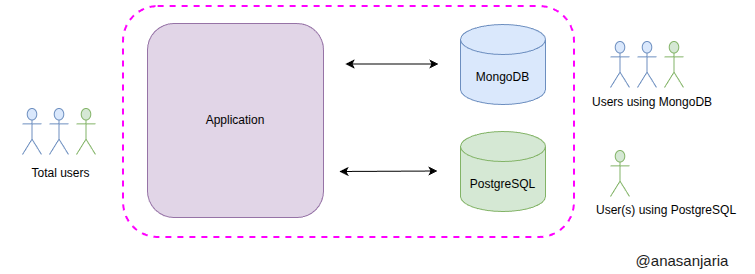
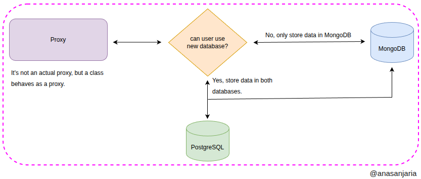

# Incremental Database Migration: Dual-Write Proxy Pattern



This project demonstrates how to incrementally migrate from one database to another (e.g., from MongoDB to PostgreSQL) 
using the dual-write proxy pattern. This approach is useful for minimizing risk and downtime during database migrations 
in production systems.



## Motivation

Migrating services in a production environment is challenging due to data consistency, downtime, and risk of data loss. 
Incremental migration allows you to gradually move traffic and data to the new database, monitor the process, 
and roll back if necessary.

## Running Tests

```sh
sbt test
```

## Learn More
For a complete article and detailed explanation, see the [Medium post](https://levelup.gitconnected.com/strategy-to-migrate-from-one-database-to-another-incrementally-21c3a1bcb0ff).