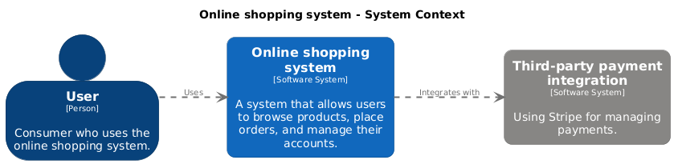
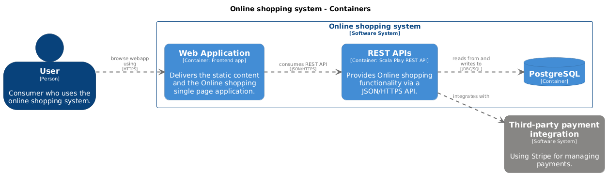

# C4 Model - Online Shopping System

This project models an online shopping system using `structurizr DSL` for architecture diagrams.

## Architecture Overview

High level overview of the system.



Diving one step deeper into our online shopping system.



## Getting Started

### Usage

1. Edit the `workspace.dsl` file to update your architecture.
2. Generate diagrams.
```
docker compose up structurizr && \
    docker compose up plantuml
```

## More examples
https://github.com/structurizr/examples